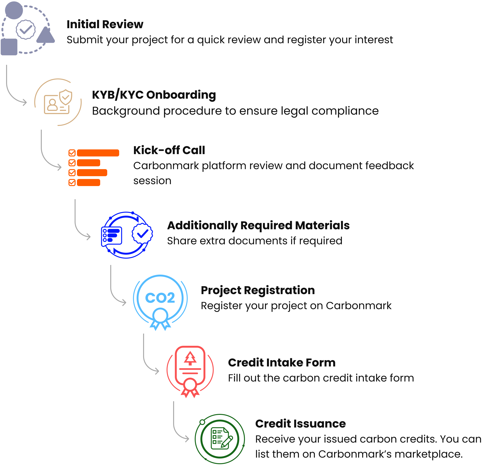

# Direct Credit Issuance

## Overview

**Carbonmark Direct** provide a pathway for innovative carbon projects that employ methodologies that may not be supported by existing carbon registries to utilize Carbonmark’s blockchain-based infrastructure for credit issuance, retirement, and lifecycle tracking. We thus provide an option for carbon project developers to issue directly to our platform.&#x20;

Carbonmark wallets are utilized to manage an inventory of issued credits. These credits will be represented natively by a balance of “CMARK” tokens recorded on an immutable public blockchain and conveniently managed, sold, or retired by users of the Carbonmark platform.

Every balance of credits will be represented by a unique CMARK project identifier (“CMARK-1”) and a credit vintage (“2024”), which are combined to form a unique credit identifier (“CMARK-1-2024”).

Each credit identifier is tied to a public blockchain address for audibility and transparency concerning the provenance of credit issuance, transfers, and retirements. This address can be used to view the current state on any third-party indexing service (e.g., polygonscan.com or blockscout.com).

## Key Project Information

Project pages for credits issued under Carbonmark’s direct credit issuance module include similar information to that found on our standard carbon project pages. This information includes:&#x20;

* Project geography and geolocation.
* Project descriptions and summaries.
* Methodologies, standards, and relevant documentation.
* Related Sustainable Development Goals.
* Images or media provided by the project developers.
* Credit availability and issued vintages.&#x20;

Additionally, within the Project Documentation information section, we provide publicly available materials related to the following:&#x20;

* Project design and methodology documentation.
* Monitoring period information and associated verification documents.&#x20;
* Supporting documentation, including location files, credit ownership agreements, etc.&#x20;

Importantly, our project pages provide information on the third-party validation and verification body (VVB) that conducted analyses on our issued credits. Note that, unless marked otherwise, Carbonmark only collaborates with project developers that utilize third-party VVBs recognized by leading ICROA-endorsed registry standards, in addition to those accredited by the [ANSI National Accreditation Board for GHG Validation and Verification](https://anabpd.ansi.org/Accreditation/environmental/greenhouse-gas-validation-verification/AllDirectoryListing?prgID=200\&statusID=4).

## Getting Started

The first step to joining Carbonmark as a project developer issuing credits natively within our system is to complete and submit our [Carbonmark Direct Onboarding](https://share-eu1.hsforms.com/1eaZal2LjRdCkeaWaAQ1R7wfhhlr) form to register your interest.

A few pieces of required information are necessary for our team to conduct initial due diligence on your carbon project. This includes an overview of your project technology type, methodology, stage of PDD development (i.e., is the PDD complete, in progress, etc), and information on the third-party VVB being utilized for validation and verification work. Furthermore, information on the expected volume of credits issued and what monitoring periods they follow is requested.

After our initial review, we will set up a more comprehensive discussion to learn more about your project and provide additional background on the Carbonmark platform and our role in the market.

Overall, the flow of activities is as follows:&#x20;

1. Initial review and registration of interest&#x20;
2. KYB/KYC onboarding
3. Kick-off call to discuss our review and provide an overview of the Carbonmark platform
4. Analysis of additional required materials&#x20;
5. Official registration of the project
6. Carbon credit intake form&#x20;
7. Credit issuance

<figure><figcaption></figcaption></figure>

## Smart contracts verified as secure and robust&#x20;

At Carbonmark, the security and reliability of our platform are our highest priorities. We are committed to providing a safe and transparent experience for our partners. That's why we partnered with Hashlock to perform a security audit. \
\
Hashlock audited the solidity code within the Carbonmark project, the scope of work included a comprehensive review of the smart contracts (CreditToken.sol, CreditTokenFactory.sol, Deploy.sol, Errors.sol and Validate.sol smart contracts). They tested the smart contracts to check for their security and efficiency.&#x20;

After Hashlock’s Audit, the team found the smart contracts to be “Secure.” The [audit report](https://hashlock.com/audits/carbonmark) confirms that Carbonmark’s smart contracts meet top industry security standards.
