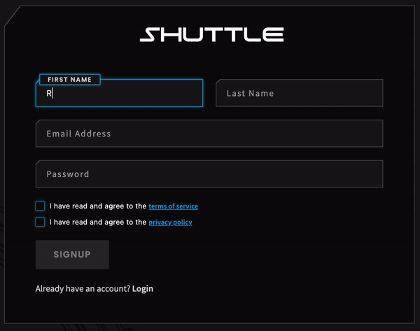
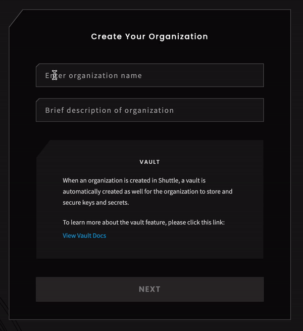

# Quickstart

**To get started using the Provide ECO API, you must make create an account and organization.**

There are two ways to register your account and organization: [Postman](quickstart.md#postman) or via [manual Shuttle sign up](quickstart.md#shuttle).

## Postman

You can programmatically onboard credentials via Postman collections.


If you're new to Postman, follow [this link](https://www.postman.com/downloads/) to either download the Postman app or access with your browser.


Download the [User Signup Postman collection](https://github.com/provideplatform/eco-api-resources/blob/main/postman/Carbonmark%20API%20-%20Provide%20Payments%20User%20signup.postman\_collection.json) from [eco-api-resources repo](https://github.com/provideplatform/eco-api-resources/) (or clone the repo) and import it into Postman.

Follow the API flow below to create a user and organization and get session access tokens.&#x20;

_You can also View Documentation within the imported collection for a detailed description of each step in the setup process._

#### **For first time setup - Execute each API request in the following order:**

1. Authorize Access Token via Basic Auth
2. List organizations
3. Generate long-dated token
4. Get access token from refresh token
5. List Vaults
6. Get Vault wallet details


You are now ready to start retiring carbon.



By default, the refresh token has an expiration every 30 days. Plan to rotate API keys accordingly!


_Follow the link below to see a demo video showing how to purchase and retire carbon with the other Postman collections._


[provide-eco-api-demo.md](provide-eco-api-demo.md)


## Shuttle

Alternatively, you can manually sign up for Shuttle in your browser.

1. Navigate to the [Shuttle signup page](https://shuttle.provide.services/signup)
2.  Create an account with an email and password

    <figure><figcaption></figcaption></figure>
3. Create your organization

<figure><figcaption></figcaption></figure>


You are not required to create a workgroup to proceed.

_Workgroups are used to provide a shared resource of rulesets, system integrations, and ecosystem configurations to the organizations, or participants, included in a workflow._ \
\
For further information regarding Shuttle, see the [Shuttle docs](https://docs.provide.technology/shuttle/).



You are now ready to start retiring carbon.


_Follow the link below to see a demo video showing how to purchase and retire carbon with the other Postman collections._


[provide-eco-api-demo.md](provide-eco-api-demo.md)


