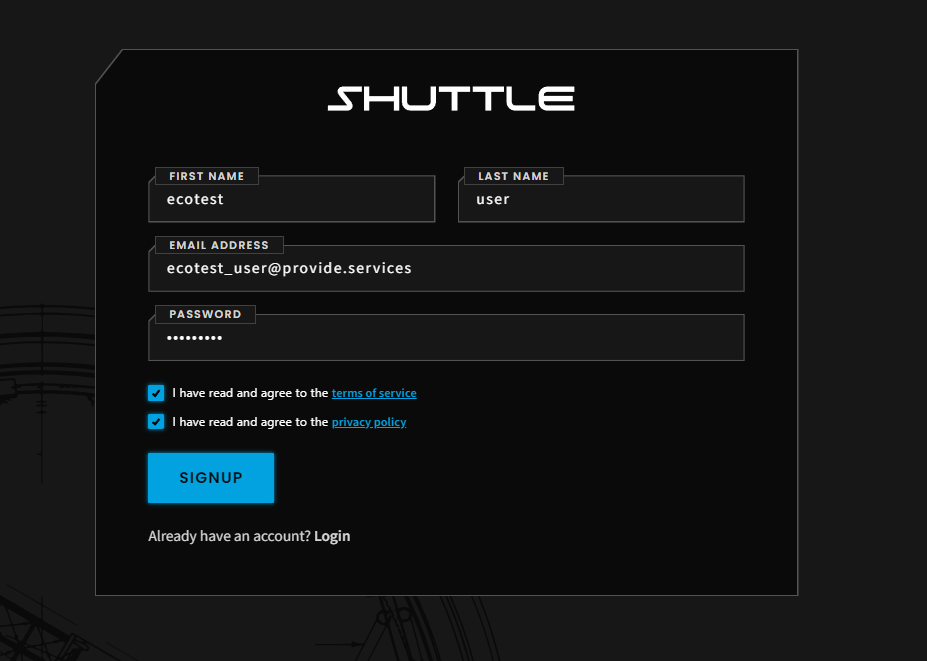
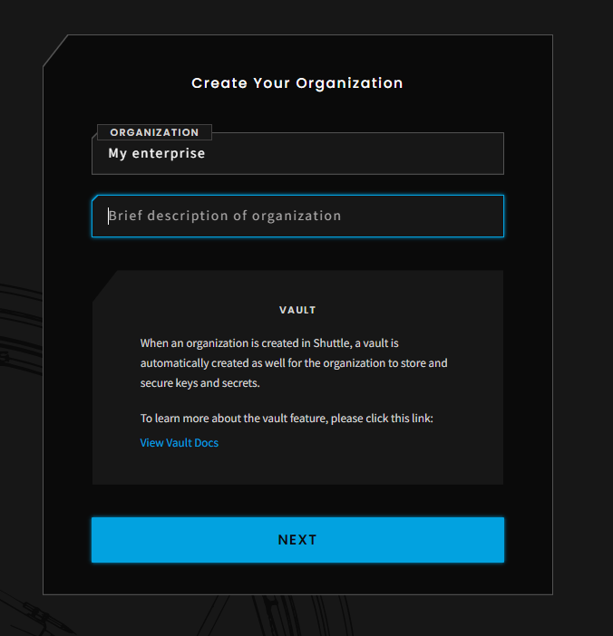

# Quickstart

To get started using Carbonmark Offset API powered by Provide Payments, you must make create an account and organization.

## Shuttle

1. Navigate to the [Shuttle signup page](https://shuttle.provide.services/signup)
2.  Create an account with an email and password\

    <figure><figcaption></figcaption></figure>
3. Create your organization

<figure><figcaption></figcaption></figure>

\

## Postman

Alternatively, you can also perform programmatic onboarding of credentials following [this example](https://github.com/provideplatform/eco-api-resources/blob/main/postman/ECO%20API%20-%20User%20signup.postman\_collection.json).
