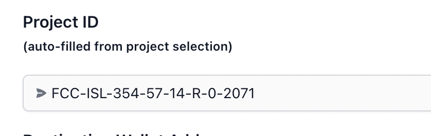

# ICR: Import Credits to Carbonmark

## Connect to ICR

* Navigate to [https://icr.carbonmark.com/](https://icr.carbonmark.com/).
* Click  `Import credits to Carbonmark` button.
* `Select Network`; the default setting is Polygon, which will be the network used for transferring credits.
* Click `Connect to ICR` button and login with your ICR account credentials.


If you are not already logged in to your ICR account, you will be prompted to login with your username and password.


* A prompt will ask if you want to install Carbonmark. This action will install the Carbonmark app on your ICR organization, along with the necessary permissions.

<figure><figcaption></figcaption></figure>

* Accept the necessary permissions for the Carbonmark app and click `Install`.  \
  \
  These permissions **do not** give Carbonmark the permission to unilaterally transfer credits on your behalf from your ICR account. You will still need to approve requested credit transfers to your Carbonmark account from your ICR organization .

<figure><figcaption></figcaption></figure>

* If installation is successful you will be redirected back to [https://icr.carbonmark.com/import](https://icr.carbonmark.com/import).


If you have previously installed the Carbonmark app on your organization you will be prompted again to install the Carbonmark app when revisiting [https://icr.carbonmark.com/](https://icr.carbonmark.com/). Click install to connect to ICR and ignore the notification that the app is already installed.


## Request Credit Transfer from ICR Organization

* Back on the **Import ICR Credits to Carbonmark** screen, click`Browse ICR Inventory` button. You will be able to see all of your organization's ICR credits and respective amounts here.
* Select the project for which you would like to transfer credits. If the selection is successful you will see the `Project ID` field auto-fill (for example):

<figure><figcaption></figcaption></figure>

* Copy in your **Carbonmark login account address** into `Destination Carbonmark Account Address`.


**IMPORTANT**: Although you will still need to review the proposed transfer within your ICR organization to finalize, **if credits are sent to the incorrect Carbonmark account address** those credits are <mark style="color:red;">**irretrievable**</mark>.  \
\
<mark style="color:red;">**PLEASE**</mark> <mark style="color:red;"></mark><mark style="color:red;">double check the account address</mark> you enter to confirm you have control of that account address.


* Enter `Quantity` of credits to transfer.
* Click `Continue` button.
* If the request is successful a popup modal will display informing that the transfer has been successfully requested. Click the link in the popup modal which will take you directly to your organization's ICR inventory.&#x20;
* If you complete the request at a later time, navigate to your ICR's organization's `Inventory` page.

<figure><figcaption></figcaption></figure>

* All requests will appear in your organization's inventory page, including past accepted and declined requests. Unconfirmed transfers will have an `Accept` button to the far right of the transfer indicated by the red arrow (all the below transfers have already been accepted or declined and thus have no confirmation button).

<figure><figcaption></figcaption></figure>

* Click `Accept` to finalize the transfer.

## Find Your ICR Credits in Carbonmark

* Navigate to your [`Carbonmark Carbon Portfolio`](https://www.carbonmark.com/portfolio) page  and connect with your Carbonmark account.&#x20;
* Your ICR credits should now appear in your portfolio.
