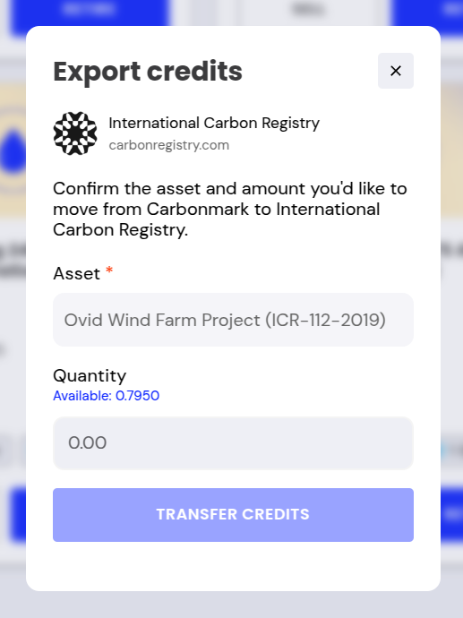
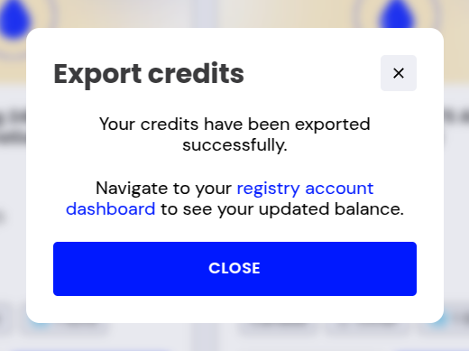
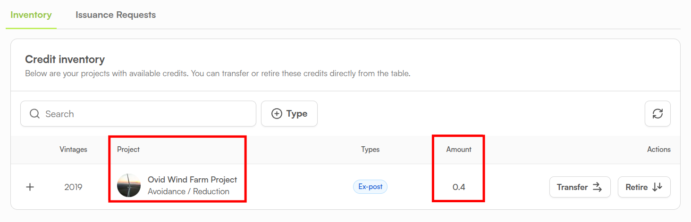

# ICR: Export Credits to ICR

## Connect to ICR

1. Navigate to [https://app.carbonmark.com/portfolio](https://app.carbonmark.com/portfolio) and log in to your Carbonmark account.
2. Click the `EXPORT CARBON CREDITS` button.
3. `Select International Carbon Registry` and click `NEXT.`
4. Click the `CONNECT TO ICR` button.


If you are not already logged in to your ICR account, you will be prompted to login with your username and password.


5. A prompt will ask if you want to install Carbonmark. This action will install the Carbonmark app on your ICR organization, along with the necessary permissions.

<figure><figcaption></figcaption></figure>

6. Accept the necessary permissions for the Carbonmark app and click `Install`.  \
   \
   These permissions **do not** give Carbonmark the permission to unilaterally transfer credits on your behalf from your ICR account. You will still need to approve requested credit transfers to your Carbonmark account from your ICR organization .

<figure><figcaption></figcaption></figure>

7. If installation is successful, you will see this message: `Successfully connected to ICR, you may now close this window`. Close the window and go back to [https://app.carbonmark.com/portfolio](https://app.carbonmark.com/portfolio).


If you have previously installed the Carbonmark app on your organization, you will be prompted again to install the Carbonmark app when revisiting [https://app.carbonmark.com/portfolio](https://app.carbonmark.com/portfolio) and executing the steps above. Click `Install` to connect to ICR and ignore the notification that the app is already installed.


## Transfer Credits to ICR Organization

1. Once the Carbonmark app has been installed on your organization, go to [https://app.carbonmark.com/portfolio](https://app.carbonmark.com/portfolio), select `EXPORT CARBON CREDITS` first, then `International Carbon Registry`, and finally click `NEXT`.&#x20;
2. You will now see the `Export credits` screen. You will be able to access all ICR credits stored in your Carbonmark Wallet and their respective amounts as seen on the screenshot below.

<figure><figcaption></figcaption></figure>

3. Select the asset you would like to transfer to your ICR organization.&#x20;
4. Enter a `Quantity` to determine how many credits of the selected type you want to export to your ICR organization.
5. Click `TRANSFER CREDITS`.
6. You will be prompted to enter the PIN associated with your Carbonmark account to finalize the transfer.


<mark style="color:red;">**This transaction is irreversible.**</mark> Ensure you are connected to the correct ICR account **before** issuing a credit transfer. When in doubt, **transfer a small amount of credits first** to confirm the connection. The smallest amount you can send is 0.001 credits.


## Confirming Credit Transfer

Once your credits have been transferred, you will see the message on the screenshot below.

<figure><figcaption></figcaption></figure>

1. Click the link contained in the message to be taken to the credit inventory of your ICR organization.
2. Confirm the expected Project and Amount are showing as seen on the screenshot below.

<figure><figcaption></figcaption></figure>
