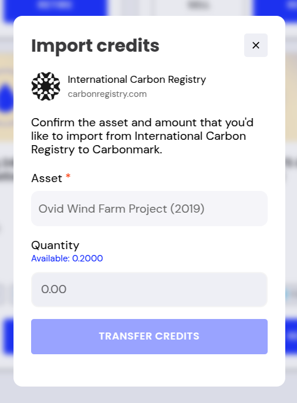
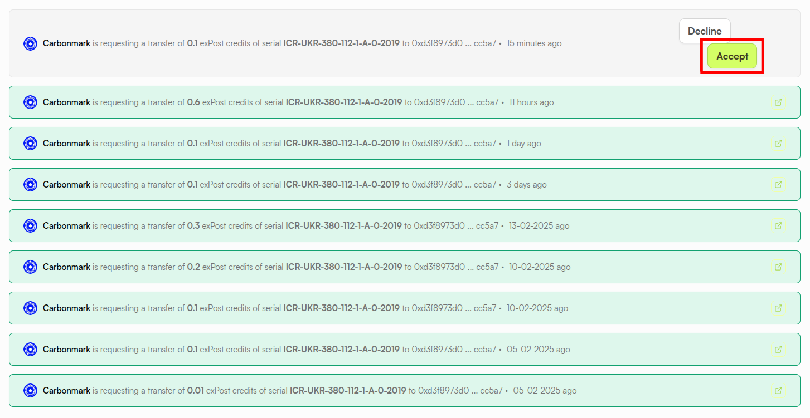
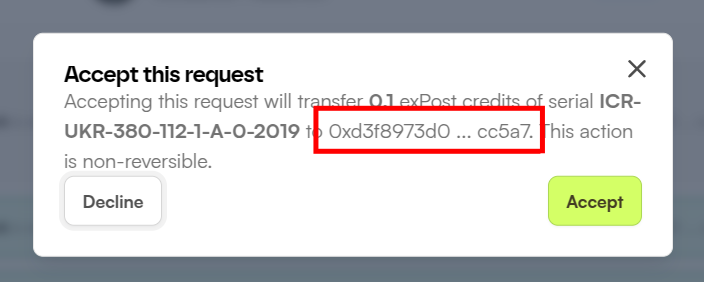
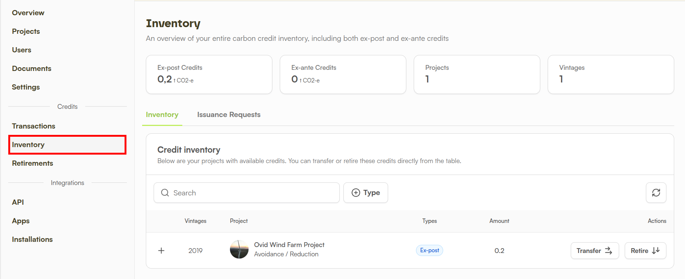

# ICR: Import Credits to Carbonmark

## Connect to ICR

1. Navigate to [https://app.carbonmark.com/portfolio](https://app.carbonmark.com/portfolio) and log in to your Carbonmark account.
2. Click the `IMPORT CARBON CREDITS` button.
3. `Select International Carbon Registry` and click `NEXT.`
4. Click the `CONNECT TO ICR` button.


If you are not already logged in to your ICR account, you will be prompted to login with your username and password.


5. A prompt will ask if you want to install Carbonmark. This action will install the Carbonmark app on your ICR organization, along with the necessary permissions.

<figure><figcaption></figcaption></figure>

6. Accept the necessary permissions for the Carbonmark app and click `Install`.  \
   \
   These permissions **do not** give Carbonmark the permission to unilaterally transfer credits on your behalf from your ICR account. You will still need to approve requested credit transfers to your Carbonmark account from your ICR organization .

<figure><figcaption></figcaption></figure>

7. If installation is successful, you will see this message: `Successfully connected to ICR, you may now close this window`. Close the window and go back to [https://app.carbonmark.com/portfolio](https://app.carbonmark.com/portfolio).


If you have previously installed the Carbonmark app on your organization, you will be prompted again to install the Carbonmark app when revisiting [https://app.carbonmark.com/portfolio](https://app.carbonmark.com/portfolio) and executing the steps above. Click `Install` to connect to ICR and ignore the notification that the app is already installed.


## Request Credit Transfer from ICR

1. Once the Carbonmark app has been installed on your organization, go to [https://app.carbonmark.com/portfolio](https://app.carbonmark.com/portfolio), select `IMPORT CARBON CREDITS` first, then `International Carbon Registry`, and finally click `NEXT`.&#x20;
2. You will now see the `Import credits` screen. You will be able to access all of your organization's ICR credits and their respective amounts as seen on the screenshot below.

<figure><figcaption></figcaption></figure>

3. Select the asset for which you would like to issue a transfer request.&#x20;
4. Enter a `Quantity` to determine how many credits of the selected type you want to import to Carbonmark.
5. Click `TRANSFER CREDITS`.
6. A popup will inform you that the transfer has been requested successfully. Click the link contained in that message to be taken directly to your organization's ICR inventory.&#x20;
7. All requests will appear in your organization's inventory page, including past accepted and declined requests. Unconfirmed transfers will show an `Accept` button as highlighted on the screenshot below.

<figure><figcaption></figcaption></figure>

6. Click the mentioned `Accept` button.
7. You will see a message which asks you once more to `Accept` the transfer. Once you click the button, the request will be fulfilled and the credits will be sent to the address highlighted on the screenshot below (which should be your Carbonmark Wallet address).&#x20;


**IMPORTANT**: **If credits are sent to an incorrect Carbonmark Wallet address**, those credits are <mark style="color:red;">**irretrievable**</mark>.&#x20;

While the correct address should be selected automatically by our systems, <mark style="color:red;">**PLEASE**</mark> <mark style="color:red;">**double check the account address**</mark> shown to you to confirm you have control of that account address. When in doubt, issue a request for a small amount first to confirm the connection. The smallest amount you can request is 0.001 credits.


<figure><figcaption>
The Carbonmark Wallet address associated with your Carbonmark account.
</figcaption></figure>

### Completing Open Requests

You can complete open requests **at any later date** by navigating to your ICR's organization's `Inventory` page as seen on the screenshot below.

<figure><figcaption></figcaption></figure>

## Find Your ICR Credits in Carbonmark

Once a transfer request on ICR's app has been completed, go back to [https://app.carbonmark.com/portfolio](https://app.carbonmark.com/portfolio). The transfer of your assets usually takes a few seconds, but depending on network load it might take a few minutes. Once the transfer is completed, your credits will appear in your portfolio. Try refreshing the page if they do not show up.
